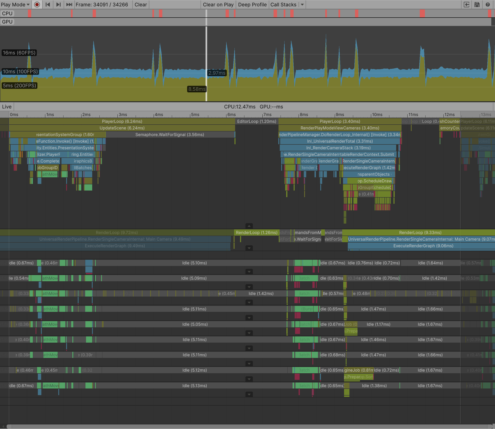
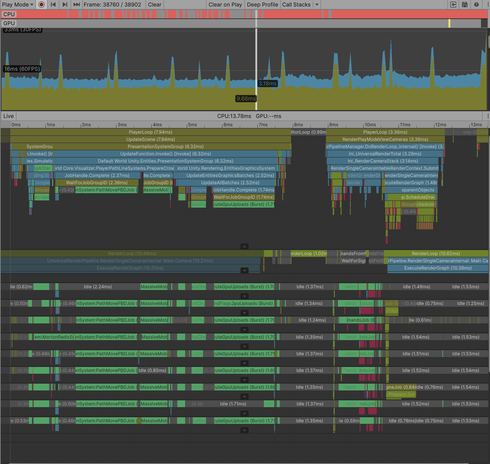
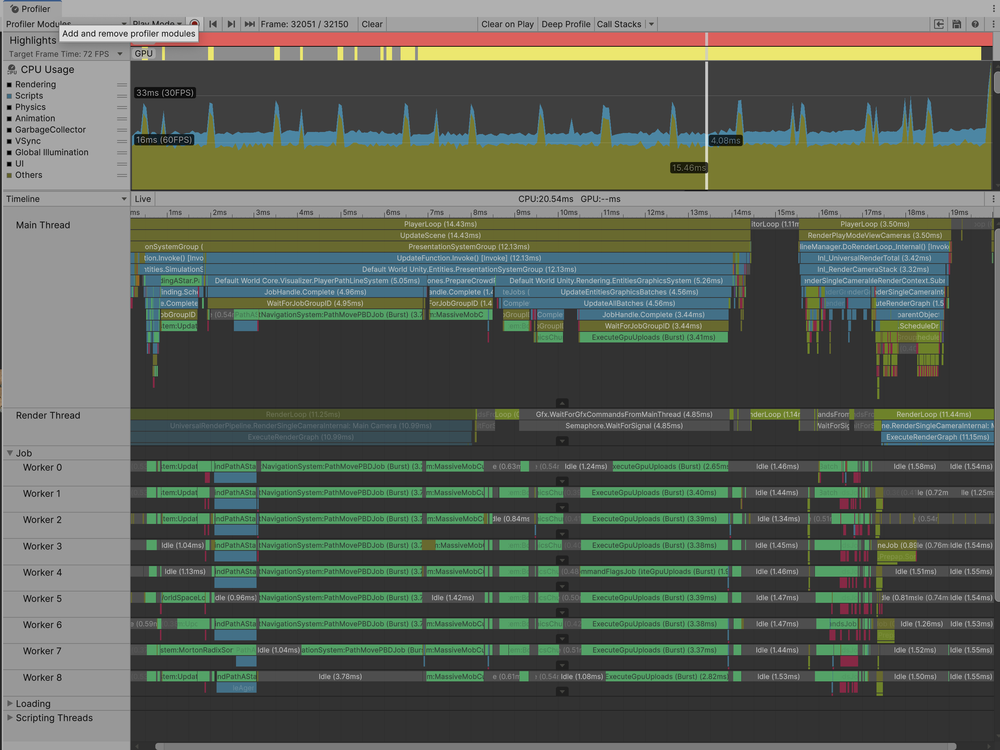

# Massive-Nav-DOTS

**High-performance massive-scale pathfinding core for Unity ECS.** Designed to handle **100,000+ agents** simultaneously using A*, Spatial Hashing, and PBD-based collision resolution. Optimized for Unity 6 and the Data-Oriented Technology Stack (DOTS).

---

## 📺 Video Demo (100,000 Agents in Action)

*Click the image above to watch the performance stress test on YouTube.*

---

## 🛠 Setup & Launch Instructions

To run the simulation in the Unity Editor, follow these steps:

1. **Open Scene**: Navigate to the project folder and open the `demo_ecs` scene.
2. **Generate World**:
    - Select the **MapGenerator** object in the **Hierarchy**.
    - In the **Inspector**, find the `Map Editor Generator` script component.
    - Click the **Context Menu** (the three vertical dots ⋮ in the top-right corner of the component).
    - Select **Generate World**. This will initialize the grid, obstacles, and navigation data.
3. **Run**: Press the **Play** button. The simulation (100k agents) will start automatically.

---

## 📊 Performance Benchmarks (Apple M1 Pro)

The simulation is strictly DOTS-based, leveraging the Burst Compiler and Job System to distribute the load across all available CPU cores. Below are the profiler captures for different agent counts, demonstrating stable performance under massive stress.

### 1. 10,000 Agents (Base Load)
* **Performance**: Extremely smooth, high FPS.
* **Profiler**: Burst-compiled jobs consume minimal time per frame.

### 2. 50,000 Agents (Scalability Test)
* **Performance**: Stable performance with multiple job worker threads fully utilized.
* **Analysis**: High-load scenario. Core systems (Parallel A*, PBD, and NativeBinaryMinHeap) operate with zero managed allocations. The primary bottleneck at this scale is **GPU Overdraw** due to entity density.

### 3. 100,000 Agents (Stress Test)
* **Performance**: Maintaining ~40+ FPS (including Editor overhead).
* **Profiler**: Core systems remain optimized with zero managed allocations, demonstrating the efficiency of the **NativeBinaryMinHeap** and PBD implementation.

> The simulation is CPU-efficient with significant headroom. Performance fluctuations at 100k+ are primarily GPU-bound.

> **Note**: These metrics were captured within the Unity 6 Editor on an Apple M1 Pro. Expect significantly higher performance in a standalone build.

---

## Project Overview
This is a performance-first navigation engine built strictly on the **Unity DOTS** stack, focusing on high-density agent simulations.

### Key Features
* **Data-Oriented Design**: Built 100% using ECS, Job System, and Burst Compiler. [Stable]
* **PBD & Spatial Hashing:** Agent separation using Position Based Dynamics with $O(1)$ grid-based neighbor lookups. Optimized with fixed-neighbor limits for stable performance in high-density scenarios. [Stable]
* **Parallel A star Pathfinding**: Multi-threaded implementation using a custom **NativeBinaryMinHeap**. Optimized with `math.select` to eliminate branch prediction overhead in the heap's sift-down operations. [Stable]
* **Flow Field Navigation**: Researching potential for large-scale directional grids to further reduce pathfinding overhead in high-density scenarios. [Planned]
* **HPA (Hierarchical Pathfinding)**: Advanced optimization for large-scale maps. [Planned]

### Performance & Optimization
* **Massive-Scale Parallelism**: Fully Burst-compiled Job System (IJobEntity/IJobChunk) distributing load across all available CPU cores.
* **Zero Managed Allocations**: The core simulation loop runs entirely on unmanaged memory using Native Containers, ensuring no GC spikes.
* **Efficient Memory Layout**: Optimized for cache locality to maximize CPU throughput.
  - Morton Encoding: Used for spatial data indexing to maximize L1/L2 cache hits during neighbor searches.
  - Double Buffering: Swap-buffer logic for Morton codes to prevent race conditions.
* **Real-time Metrics**: Maintaining ~30-40+ FPS with 100,000 active agents on Apple M1 Pro (including Editor overhead).

### Current Tech Stack
* **Engine**: Unity 6000.4.1f1
* **Packages**: Entities (ECS), Burst, Mathematics

---

## License & Copyright

Copyright (c) 2026 VraKorvis. All rights reserved.

This software and its source code are the intellectual property of the author.
Unauthorized copying, modification, or distribution is strictly prohibited.
For review and educational purposes only.

---

### Credits & Assets
* **Ant** by Poly by Google [CC-BY] via [Poly Pizza](https://poly.pizza/m/90PJjBye5ZC)
* **Beetle** by Poly by Google [CC-BY] via [Poly Pizza](https://poly.pizza/m/4yufxgZ1QQ2)